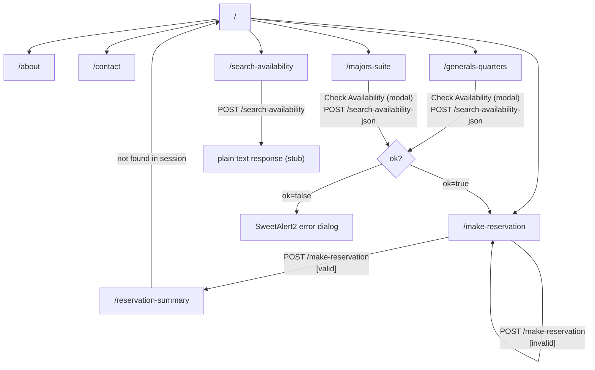
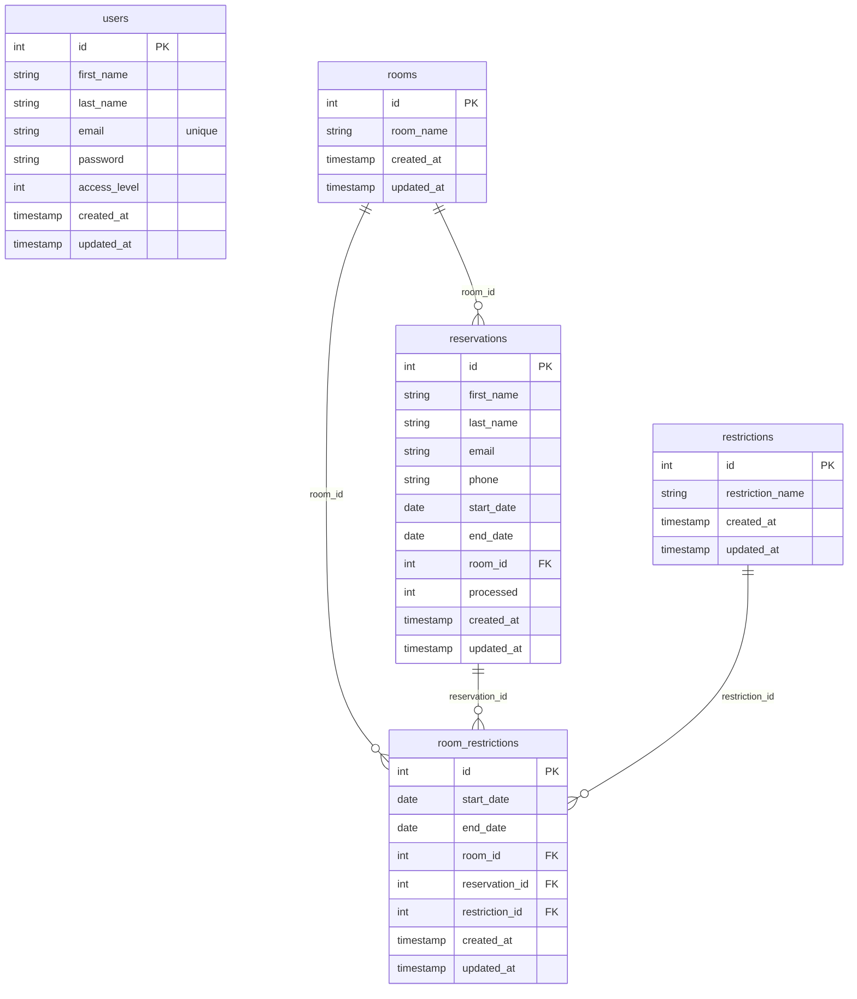

# Bookings App — Codebase Report

## Tech Stack

| Layer | Technology |
|-------|-----------|
| Language | Go 1.26 |
| Router | Chi (`github.com/go-chi/chi`) |
| Templating | Go `html/template` |
| Sessions | SCS v2 (`alexedwards/scs`) |
| CSRF | nosurf (`justinas/nosurf`) |
| Database | PostgreSQL (via `pgx` driver) |
| Form validation | govalidator |

---

## Frontend

### Pages

#### 1. Home (`/`)
**Features:**
- Carousel (image slider) with a welcome message
- CTA button linking to `/search-availability`

**Page structure:**
- Carousel component
- CTA button → `/search-availability`

**APIs used:** None

---

#### 2. About (`/about`)
**Features:** Static informational content.

**APIs used:** None

---

#### 3. Contact (`/contact`)
**Features:** Static contact information.

**APIs used:** None

---

#### 4. General's Quarters (`/generals-quarters`)
**Features:**

- Room detail view
- "Check Availability" button that opens a modal dialog
- Modal contains a date range picker (start/end date)
- On submission, sends an AJAX request and shows a SweetAlert2 dialog with the result

**Page structure:**
- Room description
- "Check Availability" button → triggers modal
  - Modal: DateRangePicker input
  - Submit → AJAX `POST /search-availability-json`
  - On success (`ok: true`): SweetAlert2 confirmation → link to `/make-reservation`
  - On failure: SweetAlert2 error dialog

**APIs used:**

- `POST /search-availability-json` (AJAX, JSON response `{ok, message}`)

---

#### 5. Major's Suite (`/majors-suite`)
**Features:** Identical to General's Quarters page.

**APIs used:**
- `POST /search-availability-json` (AJAX, JSON response `{ok, message}`)

---

#### 6. Search Availability (`/search-availability`)
**Features:**
- Two date inputs for arrival and departure dates
- DateRangePicker applied to both inputs
- Form POST submission

**Page structure:**
- Form (`POST /search-availability`)
  - Arrival date input
  - Departure date input
  - Submit button

**APIs used:**
- `POST /search-availability` (form submission; current response is plain text)

---

#### 7. Make Reservation (`/make-reservation`)
**Features:**
- Reservation form with inline validation error display
- Fields pre-filled on validation failure
- CSRF token embedded in form

**Page structure:**
- Form (`POST /make-reservation`)
  - First Name (min length 3, required) + error display
  - Last Name (required) + error display
  - Email (valid email format, required) + error display
  - Phone (required) + error display
  - Submit button

**APIs used:**
- `POST /make-reservation` (form submission)

---

#### 8. Reservation Summary (`/reservation-summary`)
**Features:**
- Displays reservation data retrieved from the session
- Clears the reservation from the session after displaying

**Page structure:**
- Summary table: Name, Email, Phone
- Arrival and Departure fields (currently unpopulated — placeholders exist)

**APIs used:** None (reads from session only)

---

### Navigation Diagram

---

## Backend

### Middleware Stack

All routes pass through this middleware chain (applied via Chi):

| Middleware | Source | Purpose |
|-----------|--------|---------|
| `Recoverer` | Chi built-in | Panic recovery, returns 500 |
| `NoSurf` | `justinas/nosurf` | CSRF protection; sets CSRF cookie, validates token on unsafe methods |
| `SessionLoad` | SCS | Loads and saves session data per request |

**Session configuration** (`main.go`):
- Lifetime: 24 hours
- Cookie: `HttpOnly`, `SameSite=Lax`, `Secure` (in production only)
- Persist: true

---

### API Endpoints

#### `GET /` — Home
- Renders `home.page.tmpl`

#### `GET /about`
- Renders `about.page.tmpl`

#### `GET /generals-quarters`
- Renders `generals.page.tmpl`

#### `GET /majors-suite`
- Renders `majors.page.tmpl`

#### `GET /contact`
- Renders `contact.page.tmpl`

#### `GET /search-availability`
- Renders `search-availability.page.tmpl` with an empty form

#### `POST /search-availability`
- **Request body:** `start`, `end` (form values)
- **Response:** Plain text — `"start date is {start} and end is {end}"`
- Status: stub implementation

#### `POST /search-availability-json`
- **Request body:** Form data (CSRF token required)
- **Response:** JSON `{"ok": true, "message": "Available!"}`
- Status: hard-coded stub; no DB query yet

#### `GET /make-reservation`
- Renders `make-reservation.page.tmpl` with an empty `Reservation` struct and empty `Form`

#### `POST /make-reservation`
- **Request body:** `first_name`, `last_name`, `email`, `phone` (form-urlencoded)
- **Validation:**
  - `first_name`, `last_name`, `email`, `phone` — required
  - `first_name` — minimum length 3
  - `email` — valid email format (via govalidator)
- **On failure:** Re-renders form with `Form.Errors` and pre-filled values
- **On success:** Stores `Reservation` in session → redirects to `/reservation-summary`

#### `GET /reservation-summary`
- Retrieves `Reservation` from session (key `"reservation"`)
- If not found: sets error flash message → redirects to `/`
- Removes reservation from session after reading
- Renders `reservation-summary.page.tmpl`

---

### Database Schema

#### `users`
| Column | Type | Constraints |
|--------|------|-------------|
| id | integer | PK, auto-increment |
| first_name | string | default "" |
| last_name | string | default "" |
| email | string | unique index |
| password | string(60) | |
| access_level | integer | default 1 |
| created_at | timestamp | |
| updated_at | timestamp | |

#### `rooms`
| Column | Type | Constraints |
|--------|------|-------------|
| id | integer | PK, auto-increment |
| room_name | string | default "" |
| created_at | timestamp | |
| updated_at | timestamp | |

#### `restrictions`
| Column | Type | Constraints |
|--------|------|-------------|
| id | integer | PK, auto-increment |
| restriction_name | string | default "" |
| created_at | timestamp | |
| updated_at | timestamp | |

#### `reservations`
| Column | Type | Constraints |
|--------|------|-------------|
| id | integer | PK, auto-increment |
| first_name | string | default "" |
| last_name | string | default "" |
| email | string | index |
| phone | string | default "" |
| start_date | date | |
| end_date | date | |
| room_id | integer | FK → `rooms.id` (cascade), index |
| created_at | timestamp | |
| updated_at | timestamp | |
| processed | integer | |

Index on `last_name`.

#### `room_restrictions`
Composite index on `(start_date, end_date)`.

**Entity Relationships:**

---

## Other Non-Trivial Details

### Template Data (`models.TemplateData`)
Passed to every template render. Fields:
- `StringMap`, `IntMap`, `FloatMap`, `Data` — typed bags for arbitrary page data
- `CSRFToken` — injected automatically by `AddDefaultData()` from nosurf
- `Flash`, `Warning`, `Error` — popped from session on each request by `AddDefaultData()`
- `Form *forms.Form` — form state including field values and per-field errors

### Template Rendering Pipeline
1. Check `AppConfig.UseCache` flag (false in dev → always reloads)
2. Load `*.page.tmpl` files; for each, also parse `*.layout.tmpl` files
3. Call `AddDefaultData()` to inject CSRF token and session flash messages
4. Execute template to a buffer; write buffer to response (avoids partial writes on error)

### Form Validation (`internal/forms`)
- `Form` embeds `url.Values` (direct access to raw form data) plus an `errors` map
- Error map is `map[string][]string`; `Get()` returns the first error per field
- Template calls `{{with .Form.Errors.Get "field_name"}}` to conditionally render error messages

### Repository Pattern
- `DatabaseRepo` interface defined in `internal/repository/repository.go`
- PostgreSQL implementation in `internal/repository/dbrepo/`
- Currently only a stub `AllUsers() bool` method — real DB queries not yet implemented

### Database Connection Pool (`internal/driver`)
- Max open connections: 10
- Max idle connections: 5
- Connection max lifetime: 5 minutes

### Client/Server Error Helpers (`internal/helpers`)
- `ClientError(w, status)` — logs and sends HTTP error status
- `ServerError(w, err)` — logs full stack trace via `runtime/debug.Stack()` and sends 500

### JavaScript Utilities (Base Layout)
Global JS functions available on all pages:
- `notify(msg, type)` — Notie toast notifications
- `notifyModal(title, body, icon, btnText)` — Notie modal
- `Prompt()` — returns object with `toast()`, `success()`, `error()`, `custom()` methods backed by SweetAlert2 and Notie

### Authentication
Not yet implemented. The `AllUsers()` stub exists in the repository layer as a placeholder.
